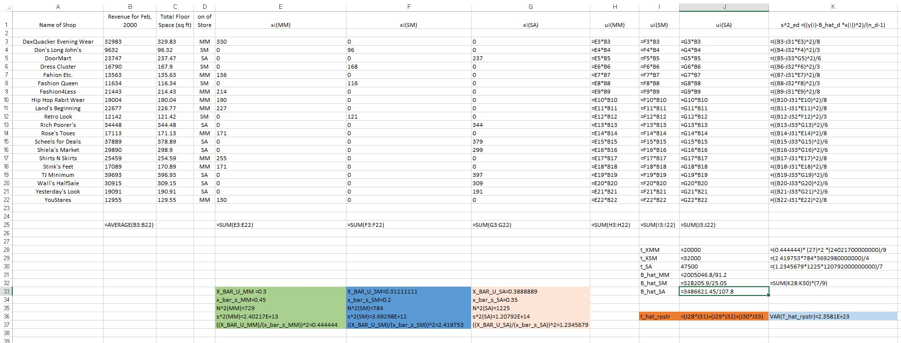

```{r setup, include=FALSE}
knitr::opts_chunk$set(echo = FALSE)
```

```{r load, include=FALSE}
library (tidyverse)
library(dplyr)
library(knitr)
library(survey)
library(sampling)
library(ggplot2)
library(readxl)
library(raster)
```

### Question 1

Using the Corona Virus data file, take 100 different simple random samples of 58 countries without replacement using the random seeds numbered 101 through 200. With each sample do the following:

```{r a}
load("~/R/STAT5060/5060hw3/corona330.RData")
cor <- corona330[,c(1,2,3,6)]
colnames(cor) <- c("Province.State","Country.Region","Cases","Deaths")
N <- length(unique(cor$Country.Region))
cor$fpc <- N
n <- 58

totx_a <-rep(NA,100)
bias_a <-rep(NA,100)
re_a <- rep(NA,100)
bias_re <- rep(NA,100)
thatr_a <- data.frame(1:100,1:2)
colnames(thatr_a)<-c("REtotest","SE")

#actual death count
truetotdeath <- sum(cor$Deaths)


for(i in 101:200){
  set.seed(i)
  corsamp <- cor[sort(sample(N,n)),]
  corsampdes <- svydesign(id = ~1, strata = NULL, data = corsamp, fpc = ~fpc)
  sampdeathtot <- svytotal(~Deaths, design=corsampdes, na.rm=TRUE)
  bias <- sampdeathtot - truetotdeath
  bias_a[i-100] <- bias
  totx_a[i-100] <- sampdeathtot
  ratestdeath <- svyratio(~Deaths, ~Cases, corsampdes)
  re_a[i-100] <- ratestdeath$ratio
  thatr <- predict(ratestdeath,total = sum(cor$Cases),se=TRUE)
  retotal <- as.numeric(thatr$total)
  thatr_a[i-100,1] <- retotal
  thatr_a[i-100,2] <- as.numeric(thatr$se)
  bias_ratio <- retotal - truetotdeath
  bias_re[i-100] <- bias_ratio
}

totx_a<-data.frame(totx_a)
bias_a<-data.frame(bias_a)
bias_re<-data.frame(bias_re)
re_a<-data.frame(re_a)
totre <- data.frame(thatr_a[,1])
colnames(totre) <- "TotRE"

totaplot <- ggplot(totx_a,aes(totx_a)) + geom_histogram(bins=30) + labs(title = "Basic Estimation")

biasaplot <- ggplot(bias_a,aes(bias_a)) + geom_histogram(bins=30) + labs(title = "Basic Estimation")

biasreplot <- ggplot(bias_re,aes(bias_re)) + geom_histogram(bins=30) + labs(title = "Ratio Estimation")

var_a<-var(totx_a)

totreplot <- ggplot(totre,aes(x=TotRE))+ geom_histogram(bins=30) + labs(title = "Ratio Estimation")

avgbias1 <- mean(bias_a[,1])

avgbias2 <- mean(bias_re[,1])

avgbias <- merge(avgbias1,avgbias2)
colnames(avgbias) <- c("totx_a","TotRE")

variance1 <- var(totx_a)
variance2 <- var(totre)

variance_est <- merge(variance1, variance2)

partf <- rbind(avgbias,variance_est)
rownames(partf) <- c("Average Bias", "Variance")
colnames(partf) <- c("Estimate 1", "Estimate 2")

MSE_me <- variance1 +(avgbias1^2)

MSE_re <- variance2 + (avgbias2^2)

MSE <- merge(MSE_me,MSE_re)
rownames(MSE) <- "MSE"
colnames(MSE) <- c("Mean estimator", "Ratio estimator")
```

***Part a***

***Estimate the total number of deaths in the World as a result of the Corona Virus assuming you know the number of countries to be that contained in the data file.***

With this assumption, we find the number of countries by finding the number of unique values in the Country column of our dataset. The number of countries in the data set is then found to be the following.

```{r b,include=TRUE}
N
```

***Part b***

The actual death total is found by summing up the deaths contained in our population file.

```{r c, include = TRUE}
truetotdeath
```

This number is utilized to calculate the bias of each sample, which will be evident in the appendix of code as well as the graphs.

***Part c and part d***

The mechanics of these parts can be seen in the appendix of code, with the outputs represented in the graphs shown for part e.

***Part e***

First we will show histograms for estimates of the total number of deaths in the world as a result of the coronavirus. 

The graph on the left depicts our basic estimation of a total with an SRS. The graph on the right depicts the total derived from ratio estimation, where the number of cases confirmed is used as the auxiliary variable.

```{r d,fig.show="hold", out.width="50%"}
totaplot
totreplot
```

Now we will show the comparison of bias in each of the two estimations.

```{r e,fig.show="hold", out.width="50%"}
biasaplot
biasreplot
```

**Part f**

The average bias as well as the variance for each of the estimates are given below where Estimate 1 represents the basic estimate and Estimate 2 represents the estimate computed using ratio estimation.

```{r f}
kable(round(partf,digits=1))
```

**Part g**

Below is the Mean Squared Error for each estimator.

```{r g}
kable(MSE)
```

**Part h**

The result in part g makes sense. We would expect the error to be lower for ratio estimation, since we expect that there is a relationship between cases and deaths in the population.

**CODE**

```{r appendix1, ref.label=c('a'), echo=TRUE}

```

### Question 2

```{r h}
BG_data <- read_excel("~/R/STAT5060/5060hw3/BGSamplingFrame2019version2.xlsx")
```

**CALCULATING THE COEFFICIENT OF VARIATION FOR EACH OF THE VARIABLES**
```{r i}
#CALCULATING THE COEFFICIENT OF VARIATION FOR EACH OF THE VARIABLES
sqft=BG_data$SqFootage
cv1 <- cv(sqft,na.rm = TRUE)
YearBuilt=BG_data$YearBuilt
cv2 <- cv(YearBuilt,na.rm = TRUE )
Totacreage=BG_data$totACRES
cv3 <- cv(Totacreage,na.rm=TRUE)
NumRooms=BG_data$NumRooms
cv4 <- cv(NumRooms,na.rm = TRUE)
Numbedrooms=BG_data$NumBeds
cv5 <- cv(Numbedrooms,na.rm=TRUE)
Numbathrooms=BG_data$NumBaths
cv6 <- cv(Numbathrooms,na.rm=TRUE)
cvs <- rbind(cv1,cv2,cv3,cv4,cv5,cv6)
cvs <- data.frame(cvs)
rownames(cvs) <- c("Square Footage", "Year Built", "Total Acreage","Rooms","Bedrooms","Bathrooms")
colnames(cvs) <- c("Coeffecient of Variation")
```

```{r j}
kable(cvs,align='c')
```

```{r k}
#Fitting the variables in linear model
Model1<-lm(BG_data$SqFootage~BG_data$YearBuilt)
Model2<-lm(BG_data$SqFootage~BG_data$totACRES)
Model3<-lm(BG_data$SqFootage~BG_data$NumRooms)
Model4<-lm(BG_data$SqFootage~BG_data$NumBeds)
Model5<-lm(BG_data$SqFootage~BG_data$NumBaths)
```
**Plot of each of auxillary variables with their R^2 values**
```{r l}
#Plot of each of auxillary variables with their R^2 values
par(mfrow=c(2,3))
plot(BG_data$YearBuilt,BG_data$SqFootage, main="Scatterplot of Yearbuilt vs.Sqft")
abline(Model1) 
legend("topleft",cex=0.8,legend=paste("R2 is", format(summary(Model1)$r.squared,digits=6)))

plot(BG_data$totACRES,BG_data$SqFootage, main="Scatterplot of Totacres vs.Sqft")
abline(Model2) 
legend("topleft",cex=0.8,legend=paste("R2 is", format(summary(Model2)$r.squared,digits=6)))

plot(BG_data$NumRooms,BG_data$SqFootage, main="Scatterplot of Numrooms vs.Sqft")
abline(Model3) 
legend("topleft",cex=0.8,legend=paste("R2 is", format(summary(Model3)$r.squared,digits=6)))

plot(BG_data$NumBeds,BG_data$SqFootage, main="Scatterplot of Numbeds vs.Sqft")
abline(Model4) 
legend("topleft",cex=0.8,legend=paste("R2 is", format(summary(Model4)$r.squared,digits=6)))

plot(BG_data$NumBaths,BG_data$SqFootage, main="Scatterplot of Numbaths vs.Sqft")
abline(Model5) 
legend("topleft",cex=0.8,legend=paste("R2 is", format(summary(Model5)$r.squared,digits=6)))

```

```{r m, include=FALSE}
ci1<-confint(Model1,level=.95)
ci2<-confint(Model2,level=.95)
ci3<-confint(Model3,level=.95)
ci4<-confint(Model4,level=.95)
ci5<-confint(Model5,level=.95)
```

**TABLES**
```{r n,include=FALSE}
Aux_Variables=c("YearBuilt","Totacreage","NumRooms","Numbedrooms","Numbathrooms")
Coeff_Variation=c(1.809389,345.5363,23.24492,23.22344,37.00307)
Correlation_with_Sqft=c(0.35341,0.096248,0.584609,0.56246,0.72381)
Variance_Aux_Variables=c(1258.827566,2.319136,2.50448,0.5840867,0.544388)
Conf_interval_intercept=c("(-12207.278823   -8630.77010)","(1797.89183    1869.53566)","(147.3579   395.1979)","(203.3198   456.1184)","(554.0693   691.9039)" )
```
```{r o}
results=data.frame(Aux_Variables,Coeff_Variation,Correlation_with_Sqft,Variance_Aux_Variables,Conf_interval_intercept)
knitr::kable(results,"pipe")
```

The confidence intervals of the intercepts for all of the models do not contain 0. So, it is unlikley that the regression line will go through the origin. Hence, we will not be able to use the ratio estimate using any of the auxiliary variable above. So, we need to use the regression estimator. The correlation coefficient between auxiliary variable, Numbaths and outcome variable, Sqft is the greatest one which is displayed in the table above. Also, the CV of Sqft is 33.93479 which is closest to CV of auxiliary variable,Numbathrooms. The same auxiliary variable also has the smallest variance. So from all the factors combining, we can come to the conclusion that Numbathrooms would be the best auxiliary variable for regression estimate.

**CODE**

```{r appendix2, ref.label=c('h','i','k','m','n'), echo=TRUE}

```

### Question 3

```{r p}
t <- c(20000,32000,47500)
Bhat <- c(21985.16,13102.03,32343.43)
N_d <- c(27,28,35)
domain <- rbind(t,Bhat,N_d)
domain <- data.frame(domain)
colnames(domain) <- c("MM","SM","SA")
kable(domain)

t_hat <- c(2395281059)
v_t_hat <- c("2.3581 x 10^23")
se_t_hat <- c(485602718279)
values <- rbind(t_hat,v_t_hat,se_t_hat)
values <- data.frame(values)
kable(values)
```


**EXCEL**


